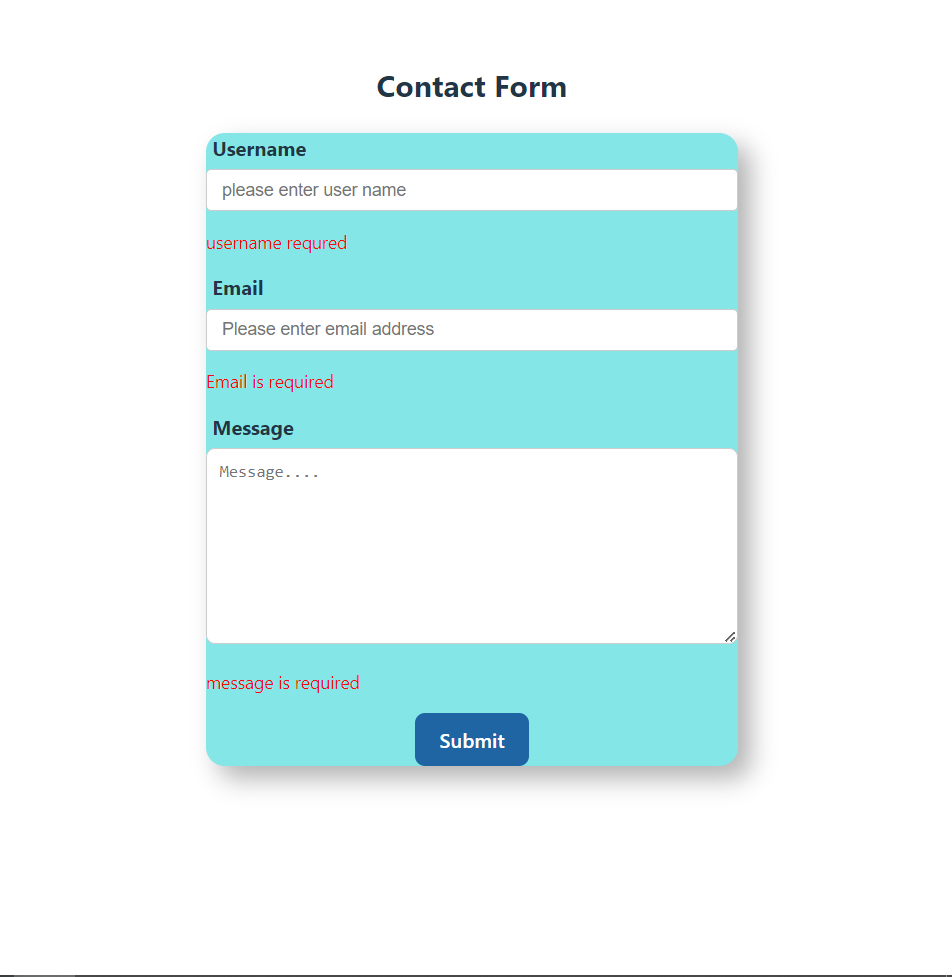
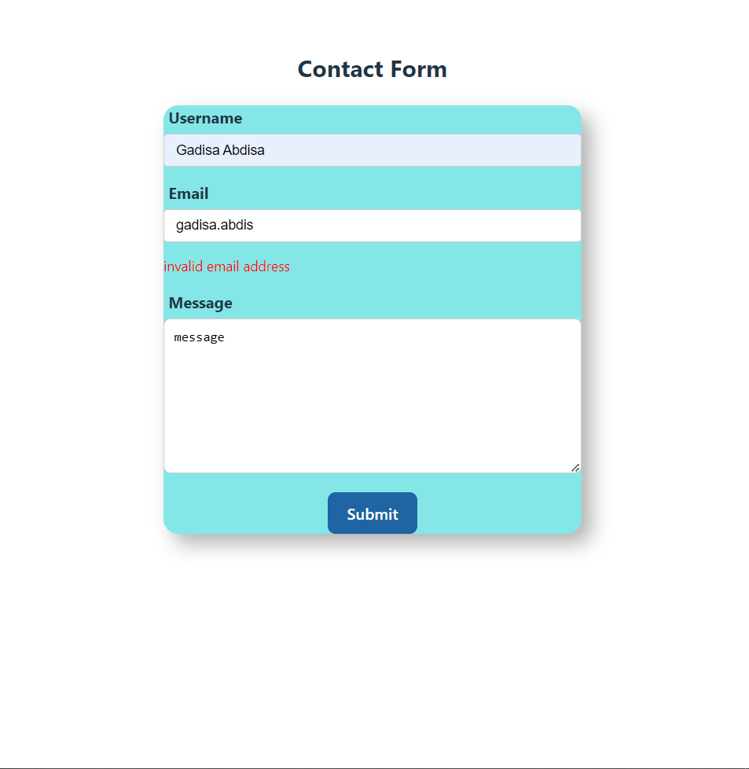

# Simple Contact Form

This project is a simple Contact Form built using React with TypeScript, react-hook-form, and CSS. The form includes fields for Name, Email, and Message, with validation to ensure that all fields are filled out and that the email address is in a valid format.

## Features

- **Form Validation**: Required fields and email format validation..
- **State Management**: Managed using react-hook-form for simplified form handling.
- **Responsive UI**: Basic responsive styling using CSS.

## Getting Started

Follow the instructions below to get the project up and running on your local machine.

- **Clone the repository**:https://github.com/Gadisa21/form-validation , cd contact-form
- **Install dependencies**:npm install.
- **Run the project**: npm run dev

## Here is the screenshots

## Here all values are required 

## Email values must be valid inputs

## After a successful form submission.clear the input values and display success Message

